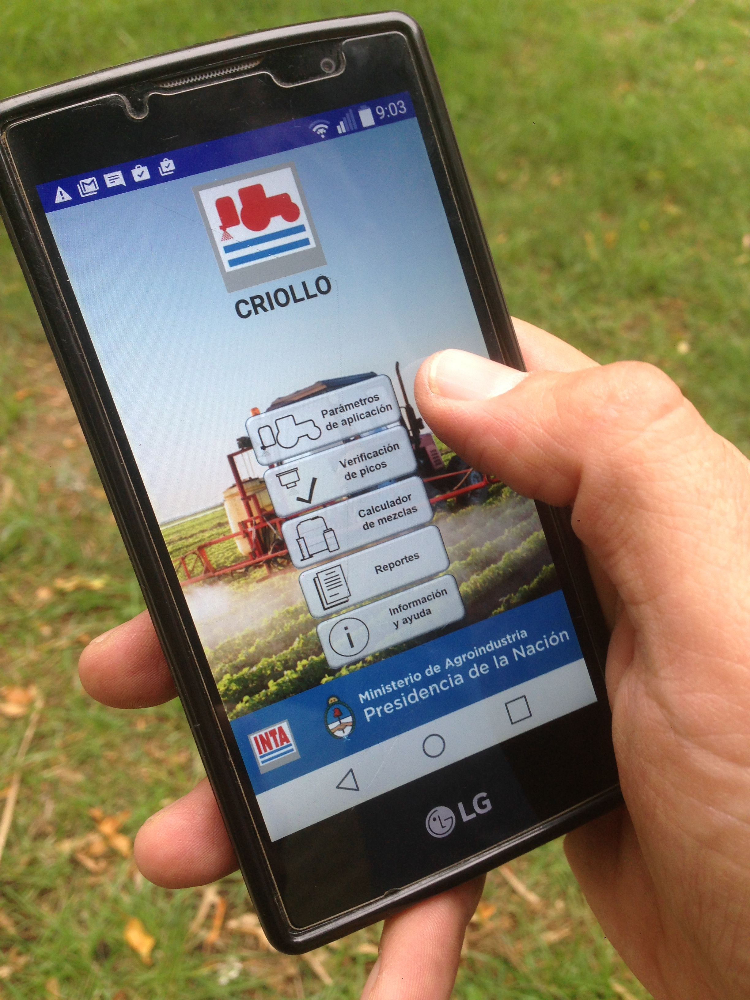

# Criollo 5 

Criollo es una aplicación utilitaria para tablets y smartphones que permite calcular los principales parámetros de operación de pulverizadoras terrestres de botalón y realizar la verificación estática correspondiente.  
Al usar la aplicación es posible calcular alternativamente la velocidad de avance del equipo, la presión de trabajo y el volumen de pulverización para un tamaño de pico y una distancia entre picos determinada. También es posible realizar la verificación de los picos y obtener el diagnóstico rápido del estado de los mismos.  
La información generada a partir del ingreso de los datos y los cálculos realizados se compila en un reporte que puede ser guardado en formato PDF y compartido mediante correo electrónico y/o WhatsApp.  
Una vez instalada, la utilización de Criollo no requiere disponibilidad de señal ni acceso a la red. Estos servicios sólo son necesarios si se desea compartir los reportes generados.         

### [Disponible en Google Play!](https://play.google.com/store/apps/details?id=com.inta.criollo2)  



### Versión 5.0 [20] (Tamaño de gota)
  - Nuevo nivel de picos para norma ISO y CEN.  
  - Cálculo de tamaño de gota según presión de trabajo.  
  - Agregado de parámetros al reporte.  

### Versión 4.2 [17] (Migración nativo -> híbrido)
  - Implementación con Vite (Rollup): ReactJS (v18) + Framework7 + Capacitor.
  - Nueva presentación. Mejoras en control y validación de campos.  
  - Se pierde el control de volumen en la vista de verificación de picos. En lugar de forzar el volumen al máximo, se avisa al usuario de que suba el volumen para que las alertas sean audibles. El control de "keep awake" se realiza con un plugin CapacitorJS.  
  - Los reportes se generan secuencialmente como en Campero y Campero Fertilizadoras.  
  - Los formularios tienen almacenamiento persistente de datos, no se pierden al cambiar de vistas o si la app queda en segundo plano, pero se borran al salir (previo confirmacion del usuario).  
  - El almacenamiento de los datos se realiza en Storage de Capacitor en el caso nativo, en avt.storage en el caso de la extensión Auravant o en localStorage en el caso web.  

## Instalación y despliegue

Descargar código fuente e instalar dependencias
```bash
$ git clone https://github.com/sendevo/criollo
$ cd criollo
$ npm install
```

Correr versión web para debug (localhost:3000)
```bash
$ npm run dev
```

Compilar versión web optimizada
```bash
$ npm run build
```

### Compilar apk (android) por primera vez:
1.- Instalar android studio y ubicar carpeta de instalación.  

2.- Agregar plataforma con capacitor y generar proyecto android-studio:  

```bash
$ export CAPACITOR_ANDROID_STUDIO_PATH="..../android-studio/bin/studio.sh"
$ export PATH=~/.npm-global/bin:$PATH  
$ npx cap add android
$ npm run build && npx cap sync
```

3.- Indicar el SDK level en app/variables.gradle
```
minSdkVersion = 21
compileSdkVersion = 30
targetSdkVersion = 31
```

4.- Agregar permisos en android/app/src/main/AndroidManifest.xml.
Para API level 31 se requiere el activity->android:exported

```xml
...
<aplication>
  ...
  android:requestLegacyExternalStorage="true"
  ...
  <activity>
    ...
    android:exported="false"
    ...
  </activity>
  ...
</application>

...
<uses-permission android:name="android.permission.INTERNET" />
<uses-permission android:name="android.permission.READ_EXTERNAL_STORAGE"/>
<uses-permission android:name="android.permission.WRITE_EXTERNAL_STORAGE" />
<uses-permission android:name="android.permission.ACCESS_COARSE_LOCATION" />
<uses-permission android:name="android.permission.ACCESS_FINE_LOCATION" />
```

4.- Definir iconos y splashcreens en android/app/src/main/res.  

5.- Abrir proyecto de AndroidStudio:
```bash
$ npx cap open android
```

### Recompilar apk (android) luego de cambios en la versión web:
```bash
$ npm run build && npx cap sync
$ npx cap open android
```

### Compilar versión release con AndroidStudio:  
1.- Editar versionName y versionCode en android/app/build.gradle   
2.- Ir al menú Build -> Generate Signed Bundle/APK...  
3.- Ingresar directorio de la firma (.jks), claves "Key Store Password" y "Key Password".  
4.- Generar app-release.apk o app-release.aab.   
5.- Preparar capturas de pantalla y lista de cambios.   


Para compilar extension auravant, agregar el siguiente tag dentro del ```<head>``` de index.html
```html
<script src="https://auraview.auravant.com/sdk/v1.0/aura-package_v1.0.js"></script>
``` 

[ ] scroll de selector de picos
[ ] Los que tienen rango entre 2 y 4 bar, cambiarlo a 1.95 - 4.05
[ ] valores de presion debajo de la barra de colores